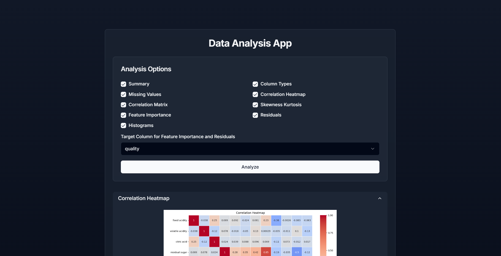

# Data Visualizer

This project consists of a backend for data analysis and a frontend for visualizing the results. I used Python for the analysis part. 

## Features

- **Summary**: Provides a statistical summary of the dataset (max, mean, min, stddev, count).
- **Column Types**: Displays the data types of each column.
- **Missing Values**: Shows the count of missing values in each column.
- **Correlation Heatmap**: Generates a heatmap to visualize the correlation between columns.
- **Correlation Matrix**: Provides a matrix of correlation coefficients.
- **Feature Importance**: Calculates the importance of each feature in predicting the target variable.
- **Residuals**: Fits linear and polynomial regression models and plots the residuals.
- **Histograms**: Plots histograms with the distribution of each column.



### Running the Backend
To run the backend:

Go to the `analysis` directory and run the Python script with:
    
    ```
    pip install -r requirements.txt
    python3 main.py
    ```


### Running the Frontend
To run the frontend:

Run the frontend using npm:
   
    ```
    npm run dev
    ```

Open [http://localhost:3000](http://localhost:3000) with your browser to see the result.

## Dataset Compatibility

Tested this project with the following dataset, and all the options work with this file:
- [Wine Quality Dataset](https://archive.ics.uci.edu/dataset/186/wine+quality)

I haven't tested many other datasets, this is more of a proof of concept. I think it would be better to first clean the data then use this tool for analysis.
